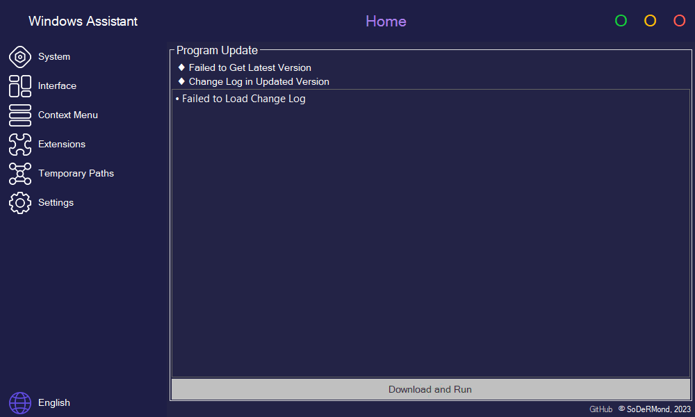

	
	<h1>Windows Assistant</h1>

	
	
	

 

	<a href="#-functions">Functions</a> •
	<a href="#-downloading">Downloading</a> •
	<a href="#-license">License</a>

***

	

***

## ♦ Functions

- Home
	- Program Update
		- Update Status Information
		- Change Log
		- Button to Download and Run the Latest Version
- System
	- "Ultimate Performance" Power Scheme
	- Windows Updates
	- Anti-Crash in Unreal Engine Games
- Interface
	- Seconds in Clock
	- Search History
	- Button to Clear Wallpapers History
	- Button to Clear Colors History
	- Corrections
		- Button to Fix the Desktop Update
		- Button to Fix the Icon Cache
- Context Menu
	- Control Panel in the Context Menu of the Desktop
	- Registry Editor in the Context Menu of the Desktop
- Extensions
	- Extension in the Context Menu New
- Temporary Paths
	- Path - <b>Double-Click to Change</b>
	- List of Paths
	- Button to Refresh the List
	- Button to Add the Path
	- Button to Delete the Path
	- Button to Edit the Path
	- Button to Copy the Path
	- Quick Access
		- Checkbox to Add to Temporary Paths
		- Button to Open the "Applications in Start" Folder
		- Button to Open the "Pinned Tiles in Start" Folder
		- Button to Open the "Taskbar" Folder
- Settings
	- Save Path - <b>Double-Click to Change</b>
	- Automatic Program Updates
	- Button to Deleting Saved Program Files
- Button to Switching Languages

***

## ♦ Downloading

• Go to the [Releases Page](https://github.com/SoDeRMond/WindowsAssistant/releases) to Download the Archive
 • Extract the Archive to Your Desktop
 • Run Windows Assistant.exe

***

## ♦ License

• Windows Assistant are Distributed Under the GPL-3.0 License